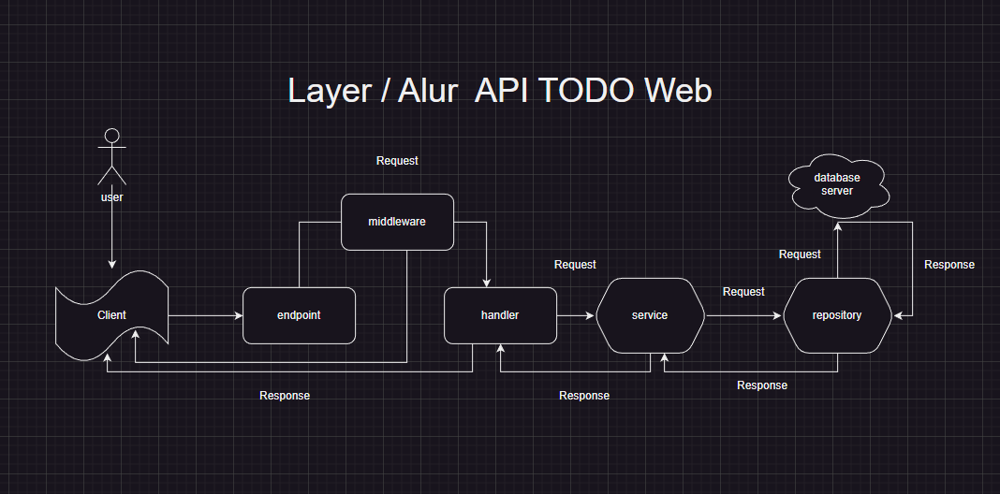

# TODO-WEB
this is web application that provides API for my mobile application that i have been developing.
the reasons of making a website:
1. as my portofolio in fullstack engineering
2. spend my time on weekend because i dont know what i to do :(
3. implementation of golang language, that i got at the last semester in ruang guru camp as backend engineering
4. to help me manage my activities
5. I hope this app can help anyone to manage their activities

## author
> [heri setyawan](https://github.com/herisetyawan12)

## Layer

## Endpoint
### 1. User
* login
* register 
* token 
* verification

### 2. Task
* add
* getAll
* getTask
* update
* remove
* moveCategory
* ...

### 3. Task
* add
* getAll
* getCategory
* update
* remove
* ...

> note: I am sorry to say because my english so bad and i will learn to be great
